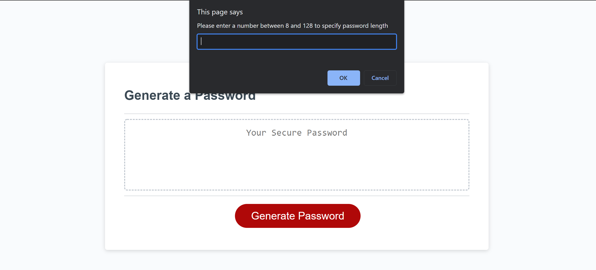
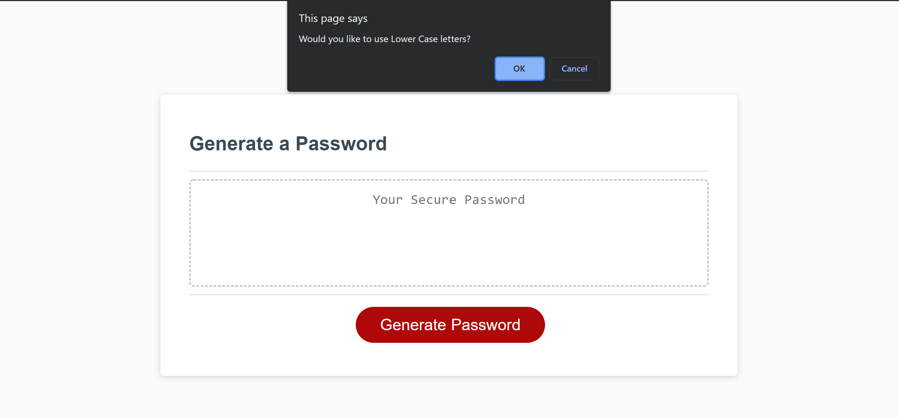
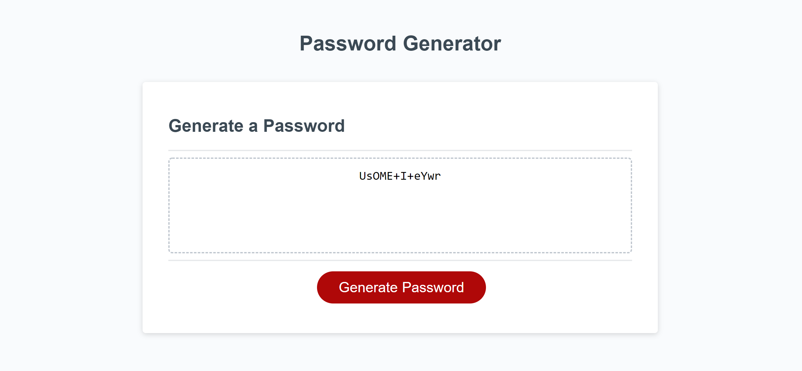

# password-generator

The purpose of this application is to provide a randomly generated password that satisfies the user's specifications. When prompted, the user inputs the number of digits they would like in their password, and indicates whether they would like Lower Case, Upper Case, Numbers, and Special Characters included in the password generation.

A key feature in this application is it's behavior when the user input does not satisfy the necessary constraints. When the password entered is too long or too short, for example, the application alerts the user to the requirements, and the function begins again. The password generator also resets if the user does not specify at least one character type to be included. 

This application can be accessed via the following link:
[https://ericaleesnyder.github.io/password-generator/]

## Usage
When the user clicks "Generate Password," they will then be prompted to indicate the length of their desired password. If they enter a password length that is too long or too short, the application will alert them and then reset the page. 

The following steps ask the user to confirm which of the four possible character types they would like to use. As long as they choose at least one, the application will generate a password. 

## Credits
My successful completion of this assignment is largely due to the help I received from a team. I worked with teammates Ivo Gatzinski and Elena Liu to troubleshoot and debug our code. 

## Challenges
This application was particularly tricky as it required use of JavaScript functions I had not implemented before this assignment. For exmaple, the use of combining arrays to contribute to the random number assignment required lots of troubleshooting.